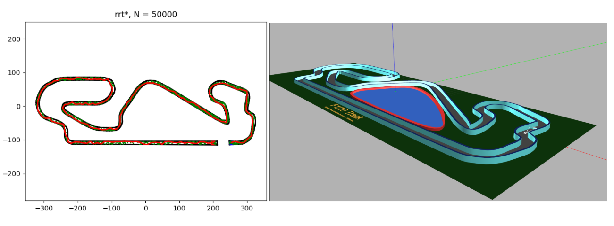

# 🏁 LQR–CBF–RRT* Path Planning on F1 Track

This repository demonstrates **safe and optimal path planning** on a **Formula 1 race track** using the **LQR–CBF–RRT*** algorithm. The implementation includes:

* A **2D planner** using Linear Quadratic Regulator (LQR), Control Barrier Functions (CBF), and RRT*
* **3D validation** using **TurtleBot3 in Gazebo** via **ROS 2**

For a larger F1 map (Circuit de Barcelona–Catalunya), the code has been optimized to achieve a **runtime of approximately 7–8 minutes**. A screen-recorded video demonstrating the performance improvements is available via the drive link provided at the end of this document.

---

## 🖼 Path Generation Result

The figure below shows:
- **Left:** LQR–CBF–RRT* path planning on the obstacle map (2D)
- **Right:** Execution and validation of the generated path in **Gazebo (TurtleBot3, ROS 2)**



---

## 📂 Folder Structure

```text
planning_submission/
├── LQR_CBF_rrtStar_planning/        # Python planner using LQR + CBF + RRT*
├── ros2_package_f1_track/           # ROS 2 package for Gazebo validation
├── LQR-CBF_result.PNG               # Sample result image
└── README.md                        # Project documentation
```

---

## 🔧 Install Dependencies

Before running the planner, install the required Python packages:

```bash
pip3 install -r requirements.txt
```

---

## 🚀 How to Run the Project

### 1️⃣ Run the LQR–CBF–RRT* Planner (2D Planning)

> **Note:** Make sure you are in the root directory of the project.

```bash
cd /path/to/final_code_ros_package
python3 LQR_CBF_rrtStar_planning/linear_dynamic_model/LQR_CBF_rrtStar_linear.py
```

✔ This will:

* Load the 2D map of the **Barcelona F1 track**
* Plan a **safe and optimal path** using LQR–CBF–RRT*
* Save the generated **waypoints** to the ROS 2 package for execution

---

### 2️⃣ Validate in Gazebo (ROS 2)

```bash
cd ros2_package_f1_track

# Source ROS 2 Humble
source /opt/ros/humble/setup.bash

# Build the workspace
colcon build

# Source the local setup
source install/setup.bash
```

➡ **Launch the F1 track world in Gazebo:**

```bash
ros2 launch turtlebot3_project3 competition_world.launch.py
```

➡ **In a new terminal, run the path-following node:**

```bash
ros2 run turtlebot_path_follower track_follower
```

---

## ✅ Test Case

* **Track:** Circuit de Barcelona–Catalunya
* **Goal:** Navigate from start to finish using an LQR-optimal and CBF-safe path
* **Output:** Smooth and collision-free trajectory executed in Gazebo

### Test Case Details

```python
x_start = (254, -108)  # Starting node
x_goal  = (200, -108)  # Goal node
```

> **Note:** This represents the **maximum distance** on the track for path generation. You can modify these values in `LQR_CBF_rrtStar_linear.py` to test different configurations.

---

## 🖼 Sample Output

* **Result Image:** `LQR-CBF_result.PNG`
* **Waypoints Location:**

  ```text
  ros2_package_f1_track/src/turtlebot_path_follower/data
  ```

---

## 💻 Performance Notes

* On a system with **Intel i7 (13th Gen)**, the runtime is approximately **7–8 minutes**.
* For best performance, ensure the laptop is **plugged in** during execution.

---

## 🔧 Troubleshooting: Module Detection Issue

If you encounter a **module import error** while running the planner, add the following lines **after line 12** in `LQR_CBF_rrtStar_linear.py`:

```python
import sys
import os
sys.path.append(os.path.abspath(os.path.join(__file__, '..', '..')))
```

---

## 🔗 Additional Resources

For **Gazebo simulation videos**, **complete source code**, and the **ROS 2 package**, visit:

👉 [https://drive.google.com/drive/folders/12aKWb8TTLxd9E-hk6cPMj8ICoBYIsaOZ?usp=drive_link](https://drive.google.com/drive/folders/12aKWb8TTLxd9E-hk6cPMj8ICoBYIsaOZ?usp=drive_link)

---

**Keywords:** LQR, Control Barrier Functions, RRT*, Motion Planning, ROS 2, Gazebo, TurtleBot3, Autonomous Navigation
